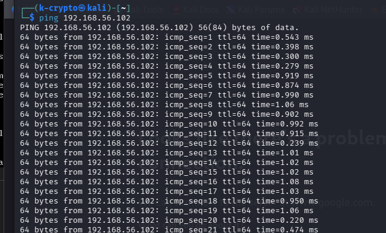
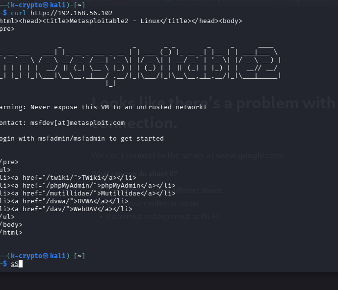
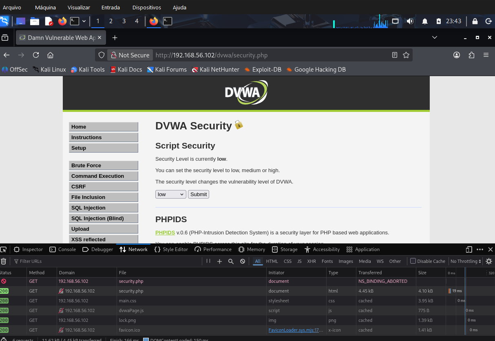
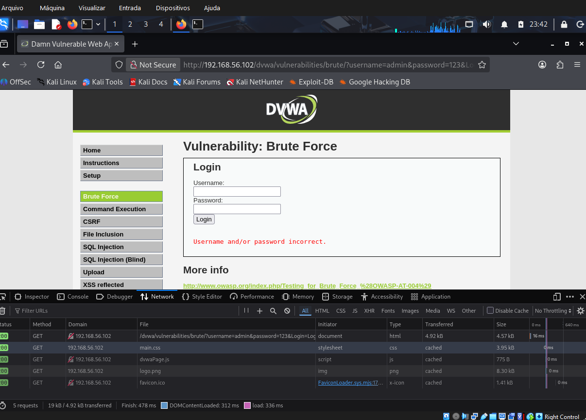
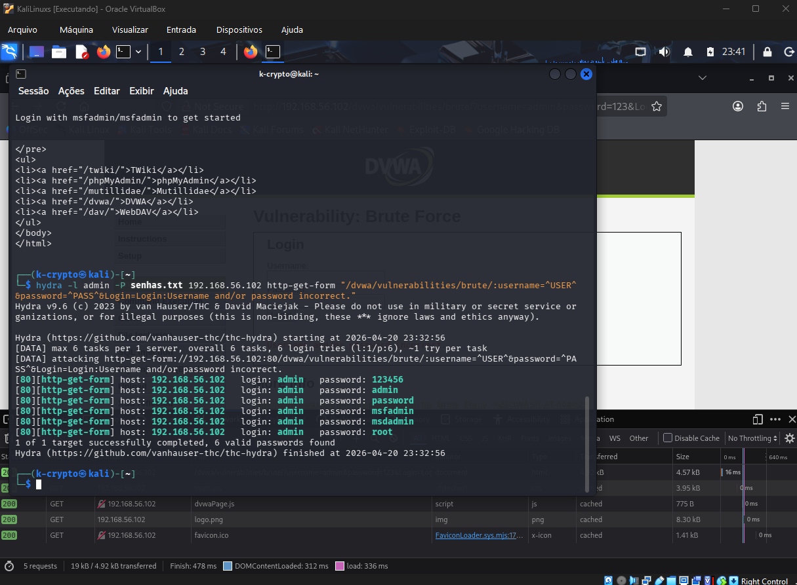

# Simulação de Ataques de Força Bruta com Kali Linux e Medusa

## Descrição

Este projeto tem como objetivo demonstrar, em ambiente controlado, a execução de ataques de força bruta utilizando Kali Linux e ferramentas de segurança ofensiva. Foram explorados serviços vulneráveis presentes no Metasploitable 2, incluindo FTP, aplicação web DVWA e SMB.

O foco do projeto é compreender o funcionamento dos ataques, validar credenciais fracas e propor medidas de mitigação.

---

## Objetivos de Aprendizagem

- Compreender ataques de força bruta em diferentes serviços
- Utilizar Kali Linux e ferramentas como Medusa e Hydra
- Identificar vulnerabilidades em ambientes controlados
- Documentar processos técnicos de forma estruturada
- Propor medidas de mitigação

---

## Ambiente Utilizado

- Kali Linux (máquina atacante)
- Metasploitable 2 (máquina alvo)
- DVWA (Damn Vulnerable Web Application)
- VirtualBox

---

## Configuração do Ambiente

Foram utilizadas duas máquinas virtuais no VirtualBox:

- Kali Linux
- Metasploitable 2

As máquinas foram configuradas em modo de rede **Host-Only**, permitindo comunicação interna entre elas sem acesso externo.

---

## Teste de Conectividade

Validação da comunicação entre as máquinas:

```bash
ping 192.168.56.102

## Evidências






